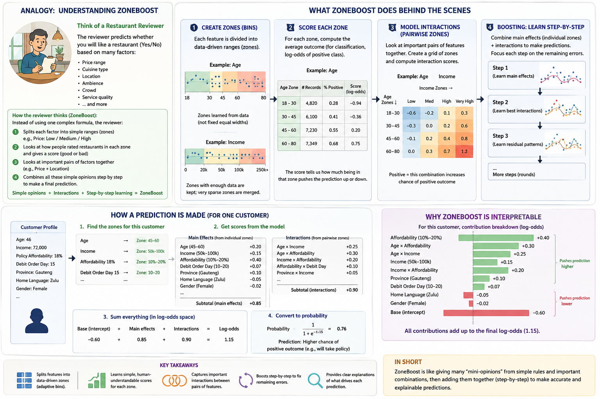

# zoneboost

Fully transparent, zone-based gradient boosting — no decision trees, no
gradient descent, no neural weights. Every number in a prediction traces
back to a quantile, a group count, or a group average, and is inspectable
directly from the fitted model.

Two estimators sharing the exact same weak learner, `ZoneBoostRegressor`
and `ZoneBoostClassifier` (binary and multiclass), plus two wrappers built
on top of them: `ConformalizedQuantileRegressor` for locally-adaptive
prediction intervals, and `BootstrapStability` for resampling-based
contribution/importance intervals and term stability. `compare_models`
compares two already-fitted `ZoneBoostRegressor` models refit on different
time periods, reporting feature-importance drift, boundary/population
shift, and prediction-shift statistics. All are scikit-learn-compatible:
they work with `Pipeline`, `GridSearchCV`, `cross_val_score`, and `clone`.



## Installation

zoneboost is currently published on **TestPyPI** only (not yet on real
PyPI):

```bash
pip install -i https://test.pypi.org/simple/ zoneboost
```

## Quickstart

```python
import pandas as pd
from zoneboost import ZoneBoostRegressor

X = pd.DataFrame({
    "rooms": [3, 4, 2, 5, 3, 4, 2, 5],
    "distance_km": [5.0, 2.0, 8.0, 1.0, 6.0, 3.0, 7.5, 1.5],
    "neighborhood": ["a", "b", "a", "b", "a", "b", "a", "b"],
})
y = [300, 450, 220, 520, 310, 470, 230, 510]

model = ZoneBoostRegressor(categorical_features=["neighborhood"], random_state=0)
model.fit(X, y)
model.predict(X)
```

```python
from zoneboost import ZoneBoostClassifier

y_class = [0, 1, 0, 1, 0, 1, 0, 1]
clf = ZoneBoostClassifier(categorical_features=["neighborhood"], random_state=0)
clf.fit(X, y_class)
clf.predict_proba(X)   # (n_samples, n_classes), rows sum to 1
clf.predict(X)          # works for binary and 3+ classes (native multinomial) alike
```

```python
from zoneboost import ConformalizedQuantileRegressor

cqr = ConformalizedQuantileRegressor(alpha=0.1, random_state=0)
cqr.fit(X, y)
lower, upper = cqr.predict_interval(X)   # locally-adaptive 90% interval, width varies with X
```

```python
from zoneboost import BootstrapStability

stability = BootstrapStability(ZoneBoostRegressor(n_rounds=100), n_bootstrap=30, random_state=0)
stability.fit(X, y)
stability.inclusion_frequency()               # how often each term appears when refit
stability.feature_importance_interval(X)      # bootstrap interval on global importance
```

## How it works

Each boosting round fits a "weak learner" made of two transparent pieces,
both built by splitting each predictor's axis into a small number of
data-driven zones and averaging the current residual within each zone (or
zone pair):

- **Main effects** — for each predictor, a 1D lookup from zone to average
  residual.
- **Interactions** — for every pair of predictors, a 2D lookup from their
  joint zones to average residual, capturing effects neither variable
  explains alone.

**Continuous** predictors get *adaptive* zone boundaries, found the way a
regression tree finds a split — the cut that most reduces the target's
within-zone variance — re-derived fresh every round from that round's
residual, rather than fixed quantile bins computed once.

**Categorical** predictors (declared via `categorical_features`, or
auto-detected from `object`/`category`/`bool` dtype) skip that search
entirely: every distinct value gets its own zone. A cut-point search
assumes two values that are numerically close behave alike — true for a
continuous variable, false for a nominal category like a neighborhood ID,
where there's no reason two adjacent label-encoded values behave similarly.

Every zone's own mean is shrunk toward a hierarchical prior via
**empirical Bayes** (see "Empirical Bayes shrinkage" below) — so sparse
zones lean toward their prior instead of overfitting a handful of rows.
Each round's correction is applied at a small, shrunk step
(`learning_rate`) and added to a running prediction, exactly like standard
gradient boosting. `row_subsample` / `col_subsample` add
stochastic-gradient-boosting-style regularization by fitting each round on
a random subsample of rows and columns.

### Missing values

Both continuous and categorical columns accept NaN/None directly — no
imputation needed beforehand. A missing value gets its own dedicated zone,
kept separate from an unseen-but-real category (a value that exists but
wasn't present at fit time), the same way an unseen category is handled.
If missingness itself is informative (a common, real phenomenon — e.g. a
sensor reading that's absent exactly when it would have been extreme), the
model learns that: the missing zone gets its own data-driven average
contribution from whichever training rows were actually missing for that
column, rather than being silently imputed away or corrupting the
adaptive split search for the column's present values.

### Classification

`ZoneBoostClassifier` uses the *identical* weak learner — same main
effects, same interactions, same empirical-Bayes shrinkage. The only
change is where boosting happens: each round is fit against the residual in
**log-odds space** (`y - sigmoid(current_score)`, the standard logistic-loss
gradient) instead of the raw target, and predictions are squashed through
a sigmoid at the end. This is the standard way gradient boosting
generalizes from regression to classification.

Binary targets fit a single log-odds booster — already a principled,
single sigmoid with no heuristic involved. 3+ classes use **native
multinomial (softmax) boosting** (see "Native multinomial boosting"
below): one booster maintains all K classes' logits jointly and optimizes
the true softmax cross-entropy, rather than K independent one-vs-rest
boosters normalized together after the fact.

### Adaptive interaction order

By default zoneboost learns main effects and every pairwise interaction
(`max_interaction_order=2`). Setting `max_interaction_order=3` additionally
attempts a bounded, adaptive search for 3-way interactions each round:
candidates are seeded from the columns appearing in that round's strongest
pairs (not every possible `(a, b, c)` triple, which would be
combinatorially expensive), and a candidate is only kept if a joint 3-way
zone grouping still explains meaningful residual variance beyond what main
effects and its three constituent pairwise interactions already predict —
evidence of a genuine higher-order pattern, not something pairwise terms
already cover. Surviving candidates are ranked by that evidence and only
the strongest `max_triple_interactions` are kept per round. If nothing
clears the bar in a given round, no triples are added that round — this is
why the default (`max_interaction_order=2`) produces identical models to
every prior release: the 3-way search is strictly opt-in.

### Cross-fitted cell means

Every zone's mean (main effect, pairwise, or 3-way) is otherwise computed
from the same rows a round then scores — each row's own residual partly
determines the zone mean it's then judged against, the same in-sample
leakage CatBoost's ordered boosting was built to fix. Left alone, this
biases the boosting trajectory optimistic about sparse zones (small
`min_zone_frac` continuous zones, high-cardinality categoricals), since a
zone with a handful of rows can end up mostly reconstructing its own
members' values rather than reflecting real structure.

Each round instead splits its (already row/column-subsampled) rows into
`cross_fit_folds` folds (default 5) and scores each fold only with zone
tables built from the *other* folds — no row is ever scored with a table
that included its own value. Only the training signal is affected; the
tables actually stored in `rounds_` and used by `predict`/`explain` still
use every available row, since new data was never part of the leakage to
begin with. This is on by default (not a `max_interaction_order`-style
opt-in) — it's a correctness fix, not a feature.

Cross-fitting also exposed a related fragility worth knowing about: a
round's raw zone-lookup score can no longer be rescaled to the residual's
units via a std-ratio (`resid_mean + (raw - raw_mean) * (resid_std /
raw_std)`), since that forces `raw`'s spread to match the residual's
regardless of how well the two actually correlate — harmless when `raw`
is in-sample-inflated (as it always was pre-cross-fitting), but once
cross-fitting honestly reveals a round found no real signal, `raw`'s
variance can legitimately collapse toward zero, and dividing by a
near-zero value amplifies noise instead of correctly damping it. This was
first fixed with an ordinary-least-squares rescale, later superseded by
the Lasso fit described next (which has the same non-amplifying property,
plus per-term weights instead of one shared scale).

### Empirical Bayes shrinkage

Every prior release weighted a zone's contribution by
`confidence = counts / counts.max()` — a flat, ad hoc discount relative to
that round's busiest zone. This is replaced by an **empirical-Bayes
(m-estimate) shrinkage** of the zone's mean itself:

```
shrunk_mean = (n · cell_mean + m · prior) / (n + m)
```

A zone needs about `m` rows of its own (`shrinkage_m`, default 10) before
it's trusted as much as its prior; fewer rows lean toward the prior, more
rows lean toward its own data. Critically, the prior is **hierarchical**,
not the flat global mean:

- **Main effects** shrink toward the global mean.
- **Pairwise interactions** shrink toward the additive combination of
  their own row and column marginals (each already shrunk the same way) —
  for a sparse joint cell, "what row A's zone alone predicts, plus what
  column B's zone alone predicts" is a far better guess than the overall
  average of everything.
- **3-way interactions** shrink one level deeper still, toward the
  additive combination of their three main effects and three pairwise
  interactions (all already shrunk).

This fully replaces the confidence mechanism rather than supplementing
it — once a cell's own mean is properly shrunk in proportion to how little
data supports it, a separate trust-discount multiplied on top is
redundant. Like the cross-fitting fix, this is on by default: a more
principled estimate, not a `max_interaction_order`-style opt-in.

**Learning `shrinkage_m` instead of hand-setting it.** `shrinkage_m`
plays the role of `sigma² / tau²` in the normal-normal hierarchical model
this shrinkage formula already implies (`sigma²` = within-zone/sampling
variance, `tau²` = between-zone variance of the *true* zone effects) — a
well-known equivalence (Efron & Morris), the same "compound normal
means" problem DerSimonian & Laird solve for random-effects meta-analysis
variance components. `learn_shrinkage_m=True` estimates this separately
for main effects and for pairs each round (pooling raw zone/cell
statistics across every column or pair fit at that level), via the
DerSimonian-Laird method-of-moments estimator — chosen over a full
numerical marginal-likelihood search for being closed-form and cheap
enough to run every round without becoming the new bottleneck.

```python
model = ZoneBoostRegressor(learn_shrinkage_m=True).fit(X, y)
model.rounds_[0]["diagnostics"]["learned_shrinkage_m"]  # {"main": ..., "pair": ...}
```

**Scope**: main effects and pairs only — triples still use the plain
`shrinkage_m` constant (deferred: the adaptive-triple-selection
accept/reject gain test already uses `m` to decide *which* triples
survive, before the accepted set is known, making a triple-level
estimate circular in a way mains/pairs aren't). Falls back to
`shrinkage_m` itself whenever there isn't enough evidence to estimate
anything better (a single zone, or no detectable signal beyond sampling
noise).

**Measured, honestly**: on synthetic data with a genuine `x1²` main
effect and a comparatively sparser `0.3·x1·x2` interaction, the learned
shrinkage strength averaged **39.7** for main effects versus **103.0**
for pairs across 80 rounds — pairs earned heavier shrinkage than mains
in **78.8%** of rounds, exactly the pattern sparser interaction cells
should show relative to better-supported main effects. Training RMSE was
essentially a wash against the hand-set default (`1.0076` learned vs.
`1.0071` at `m=10`) — the value here is a principled, per-level
calibration that removes a hand-tuned constant, not a guaranteed
accuracy improvement. `learn_shrinkage_m=False` (the default) is
bit-identical to every prior release.

### Robust cell statistics (`trim_fraction`)

A handful of outlier rows landing in one zone can drag that zone's plain
`bincount`-summed mean toward them — nothing about a mean alone is
robust to contamination. `trim_fraction` swaps the raw per-zone
statistic for a **trimmed mean** instead: sort a zone's own rows, drop
the top and bottom `trim_fraction` of them, and average the rest — still
a real average of real, observed rows (no value is altered, unlike
winsorizing), just fewer of them. The identical empirical-Bayes
shrinkage formula above applies to whichever raw statistic comes out,
exactly the way it already tolerates a quantile as the raw statistic
under `loss="quantile"`.

```python
model = ZoneBoostRegressor(trim_fraction=0.1).fit(X, y)  # drop 10% from each tail, per zone
```

**Unlike `loss="quantile"`, this doesn't change what's being estimated.**
Quantile mode targets a genuinely different point of the conditional
distribution (a location-family generalization); a trimmed mean is still
estimating the same conditional *mean*, just made robust to outliers —
so, unlike quantile mode, the Lasso combination step is completely
unaffected (`Lasso`'s intercept being the residual's own mean isn't
fighting the target the way it does for a quantile-shrunk term). The two
are mutually exclusive: `trim_fraction > 0` with `loss="quantile"`
raises `ValueError` at `fit`.

**Scope**: main effects only — pairs, triples, zone-boundary
construction, and pair-screening's cheap ANOVA proxy all stay
ordinary-mean-flavored regardless of `trim_fraction`, the same disclosed
scope `loss="quantile"` already carries for those (verified directly:
none of `_pair_shrunk_deviation`/`_triple_shrunk_deviation`/`_fit_pairs`/
`_select_triples` even accept a `trim_fraction` parameter). Compatible
with `"poisson"`/`"gamma"`/`"tweedie"` — each round's own main-effect
zone statistics are robustified there too — but the *initial baseline
intercept* for those three losses stays `_glm_baseline`'s closed-form,
untrimmed formula (no simple trimmed equivalent for it). Winsorizing
(clip outliers to a threshold instead of dropping them) is a natural
extension using the identical per-zone grouping logic, but isn't shipped
here — one well-tested mechanism over two half-built ones.

**Measured, honestly**: on synthetic data (`y = 2x`, `n=2000`) with 5
extreme outlier rows planted in one zone (`x` in `[4, 5)`, each inflated
by +200), the default `trim_fraction=0.0` predicted **17.45** at `x=4.5`
against a true value of **9.0** — dragged far off by the outliers.
`trim_fraction=0.2` predicted **9.60**, and RMSE against a clean holdout
dropped from **2.44** to **0.65**. `trim_fraction=0.0` (the default) is
bit-identical to every prior release.

### Lasso stacking

Every prior release combined a round's terms by averaging every
contribution equally (`raw = contributions.mean(axis=1)`), then fit one
shared scale for the whole blend — every term got the same diluted
`1/n_terms` weight regardless of relevance. This is replaced by a
**Lasso** fit that treats each term's own (cross-fitted) contribution as
its own feature:

- An irrelevant term's weight gets zeroed by the L1 penalty.
- A strong term gets its own learned weight instead of a diluted share.
- The fitted weights are themselves a real interaction-importance
  ranking, flowing straight through `feature_importance()`/`explain()`
  with no new API needed.

Both sides are standardized before fitting (each contribution by its own
std, the residual by its own) so `stacking_alpha` — the L1 regularization
strength — is unitless and comparable across rounds and datasets. On a
dataset with one genuine interaction mixed among several irrelevant
columns, equal-weight averaging diluted the real signal into an
unrecoverable blend (test R² ≈ 0); Lasso stacking recovered it cleanly
(test R² > 0.85) — the gap the reviewer's roadmap predicted this would
close. Like the two changes above, this is on by default.

### Soft zone boundaries

Continuous zone boundaries were hard cuts: a value one unit below a cut point and one
unit above it land in completely different zones with independently-shrunk means — a
"cliff edge" discontinuity in the prediction at the exact boundary, which doesn't match
how a genuinely continuous relationship should behave. Every real zone now also gets a
**centroid** — the empirical mean training-x-value of the rows that landed in it — and a
lookup blends between a value's own zone and whichever neighboring zone its centroid
points toward, rather than hard-assigning it to exactly one:

- 0 exactly at its own zone's centroid, 1 exactly at the neighbor's, linear between,
  clamped past either end (leftmost/rightmost zone, or a single-zone column) so it never
  reaches past a non-existent neighbor.
- Main effects become a 2-point linear blend; pairwise interactions become the standard
  4-corner bilinear blend; triples become the 8-corner trilinear analog.
- Categorical columns and missing values are an exact no-op (always fully their own hard
  zone) — there's no meaningful "distance" to interpolate along a nominal category, so
  only continuous-column lookups change. A pair/triple with a categorical member
  naturally interpolates only along its continuous member(s).

Zone *construction* (the adaptive split search, `min_zone_frac`, `max_zones`) and each
zone's own fitted mean (still computed by hard-grouping training rows, unchanged) are
untouched — only how a value is *looked up* against an already-fitted grid changes. On a
sharp step function, the largest single-step prediction change across an infinitesimal
step over the true boundary dropped from ~3.9 (almost the full step size) to ~0.2 — and,
consistent with "helps generalisation," a continuous-interaction test case's held-out R²
improved further on top of what cross-fitting/shrinkage/stacking already delivered. Like
the three changes above, this is on by default; there's no natural partial-strength knob
to expose as a parameter, so no new one was added. Fitting cost is meaningfully higher
than before (roughly +40% wall-clock in benchmarks) — a real, disclosed tradeoff for
eliminating the discontinuity, not a free change like cross-fitting/shrinkage were.

### Cyclic backfitting

A pairwise interaction's shrunk deviation was the **joint** cell mean — not an
interaction-only signal. If column `a` has a genuine main effect and no real
interaction with `b` exists, the joint `(a, b)` cell mean still reflects `a`'s
main effect (shrunk toward a `dev_a + dev_b` prior that itself contains it), so
the stored pair redundantly re-encodes signal `a`'s own main effect already
captures — and since Lasso stacking can only apply one scalar weight per term,
it can't cleanly cancel a redundant *shape* baked in cell-by-cell. The same gap
applied to triples: the accepted triple's stored value was fit against the raw
residual, even though the accept/reject gain test already computes an
approximate "residual after lower-order terms" for its own threshold decision.

Terms are now fit via a single backfitting pass each round — main effects
first, then pairs (backfit against their own two main effects), then triples
(backfit against their own three main effects, with pairs handled
automatically inside the triple's own recursive prior computation) — so a
pair's or triple's stored value is genuinely interaction-only rather than a
partial copy of what a lower-order term already explains. Not a full
iterate-to-convergence GAM backfit: one ordered pass per round, relying on the
boosting loop's own many rounds for further refinement over time. On data with
a real main effect and no real interaction, this cut the pair term's
Lasso-stacked importance by roughly 40% end-to-end (and by ~5-6x at the level
of a single round's raw fit, before stacking softens it further) — directly
improving what `explain()`/`feature_importance()` show, not just internal
accuracy. Like the four changes above, this is on by default; there's no
tunable knob to expose, so no new parameter was added.

### Monotonic constraints

Unlike the four changes above, this one is **opt-in**: it encodes domain
knowledge the model has no way to infer on its own (e.g. "take-up must
not decrease as affordability rises"), rather than a general correctness
or estimation improvement everyone should get by default. Pass
`monotonic_constraints={"column": +1}` (non-decreasing) or `{"column":
-1}` (non-increasing) — same name/index convention as
`categorical_features` — and that column's own **main effect** is
projected onto the nearest monotonic sequence across its zones via a
row-count-weighted isotonic regression, after empirical Bayes shrinkage
so sparse zones don't distort the projection. Scope is deliberately
narrow:

- **Inherited by interactions.** Every pairwise/triple term the column
  participates in is also projected along that column's own axis, holding
  the other axis/axes fixed — automatic whenever a constraint is declared,
  no separate opt-in (see "Global shape constraints" below for how).
- A continuous column's zones are already ordered low → high by
  construction, so there's no threshold or window to tune — just a
  direction.
- A constraint declared on a categorical column is silently dropped (no
  meaningful order to constrain for a nominal category) rather than
  raising; an invalid direction (anything other than `-1`/`1`) does
  raise, at `fit()` time.
- The missing-value zone is excluded from the projection — it's a
  separate bucket, not part of the ordered continuum.

Leaving `monotonic_constraints=None` (the default) reproduces the exact
same predictions as before this change — verified bit-for-bit.

### Global shape constraints

Four related mechanisms for declaring shape knowledge the model has no
way to infer on its own — all **opt-in**, all main-effects-focused, all
reusing the same `{column: ...}` declaration convention as
`monotonic_constraints`:

**Interactions inherit monotonicity.** Declaring `monotonic_constraints=
{"age": 1}` now also projects every pairwise/triple interaction `age`
participates in along `age`'s own axis (holding the other axis/axes
fixed) — via `sklearn.isotonic.IsotonicRegression` fit fiber-by-fiber
(one independent fit per slice along the constrained axis), weighted by
that slice's own row counts, the multi-dimensional generalization of the
main effect's own projection. Without this, a column's *total* dependence
on the target (main effect + every interaction it's part of) could still
come out non-monotonic overall, undermining the point of declaring the
constraint in the first place. **This changes behavior for existing
`monotonic_constraints` users** — disclosed as completing the feature's
original intent (interactions were deliberately unconstrained before),
not a free correctness fix. A term with more than one constrained axis is
projected axis-by-axis in a fixed order — a disclosed heuristic, not a
jointly-optimal multi-dimensional isotone regression, consistent with
cyclic backfitting's own single-pass approximation. **Measured, honestly**,
on synthetic data with a genuine non-monotonic dip in an interaction term:
the unconstrained interaction's largest single-step *decrease* was -0.189;
constrained, it was exactly 0.000 (fully non-decreasing).

**Convexity/concavity constraints**: `convexity_constraints={"column": +1}`
(convex) or `{-1}` (concave) forces a continuous column's *main effect*
onto a convex/concave sequence. A convex piecewise-linear function through
zone centroids `(center_i, y_i)` requires non-decreasing *slopes*
`(y[i+1]-y[i])/(center[i+1]-center[i])` — not non-decreasing raw
differences, since zones are rarely evenly spaced (adaptive zone
boundaries). This isotonic-regresses those slopes, reconstructs, and
re-centers to the original level. **Guarantees convexity of each
boosting round's own stored value, not the ensemble's cumulative
multi-round main effect**: a sum of convex functions is convex only when
combined with non-negative weights, but a round's own Lasso-stacking
weight for a term can be negative, flipping a convex round's contribution
to concave in the combined output — a real, disclosed limitation of
layering a per-round shape constraint on top of signed Lasso stacking
(monotonicity has the identical gap; see `strict_shape_constraints`
below for an ensemble-level fix for both).
**Measured, honestly**: across 60 rounds fit on genuinely non-convex
(wiggly) synthetic data, every single round's own projected slopes were
non-decreasing (0 violations) — the guarantee holds exactly where it's
actually made.

**Ensemble-level guarantees**: `strict_shape_constraints=True` restricts
a round's own Lasso-stacking weight to be non-negative for every term a
`monotonic_constraints`/`convexity_constraints` entry applies to (a
monotonic column's own main effect *and* every pair/triple it
participates in, since interactions inherit the projection too;
convexity is main-effects-only) — turning the per-round-only guarantees
above into a real ensemble-level one: a non-negative-weighted sum of
individually-monotonic (or individually-convex) round contributions is
itself monotonic (or convex), a mathematical guarantee, not a heuristic.

```python
model = ZoneBoostRegressor(
    monotonic_constraints={"x1": 1}, strict_shape_constraints=True,
).fit(X, y)
```

Implemented by representing every *unconstrained* term's weight as the
difference of two non-negative variables (`w_free = w_free+ - w_free-`)
and fitting a single `sklearn.linear_model.Lasso(positive=True)` on the
expanded design — `Lasso` only supports `positive=True` for *every*
coefficient, not a per-term subset, but at the L1-optimal solution
`w_free+`/`w_free-` are never both positive for the same term (reducing
both by `min(w_free+, w_free-)` leaves the fit unchanged but strictly
shrinks the penalty), so `w_free+ - w_free-` recovers *exactly* the
solution the original mixed-sign-constrained problem would have — not an
approximation, and reuses `sklearn.linear_model.Lasso` entirely, no new
numerical algorithm.

Does **not** extend to `bounded_effects` — non-negative weights don't fix
its own cumulative-total gap at all (summing several non-negatively-
weighted, individually-bounded contributions makes the cumulative range
*wider*, never narrower); that gap remains, disclosed, unchanged. Only
applies to the ordinary-Lasso combination step (`loss` in
`"squared_error"`/`"poisson"`/`"gamma"`/`"tweedie"`) — raises
`ValueError` at `fit` if `loss="quantile"` and either constraint dict is
set (`QuantileRegressor` has no `positive=True` mode).

**Measured, honestly**: on synthetic data engineered to induce sign
ambiguity (a near-duplicate redundant feature), the unconstrained fit
produced 3 rounds with a negative main-effect weight and 13 rounds with
a negative weight on an interaction involving the constrained column,
out of 100 rounds — `strict_shape_constraints=True` eliminated all 16.
This is a real, verified internal-consistency fix (the model no longer
contradicts its own per-round monotonic construction anywhere), which is
what mathematically guarantees ensemble-level monotonicity going
forward — though on this particular dataset, the *aggregate* curve
already happened to look monotonic even without it (the 16 flipped-sign
rounds were individually too small to visibly bend the total). This is a
real, non-free regularization (it can change a round's own fit even when
no sign-flip problem existed for a particular model), so it's opt-in:
`strict_shape_constraints=False` (the default) reproduces the exact same
predictions as if this parameter didn't exist.

**Bounded effects**: `bounded_effects={"column": (lower, upper)}` clips a
continuous column's main-effect deviation to this range, applied last
(after monotonic/convexity projection). **Bounds each round's own
contribution, not the cumulative multi-round total**: with
`learning_rate` shrinkage and many rounds, the summed contribution across
all rounds can still exceed `(lower, upper)` even though no single
round's own value ever does. **Measured, honestly**: with
`bounded_effects={"x1": (-5.0, 5.0)}`, the worst per-round violation
across every round was exactly 0 — but the *cumulative* contribution
range across all rounds was 19.81, well past the declared width of 10.
This is a real regularization (no single round's zone-fitting produces an
extreme outlier value for that term), not a business-rule guarantee on
the final prediction's total range.

**Forbidden interactions**: `forbidden_interactions=[("col_a", "col_b")]`
excludes that pair from pairwise interaction discovery entirely (both the
exhaustive and `max_pair_interactions`-screened paths), and any 3-way
candidate whose three constituent pairs include a forbidden one is
skipped too. Raises `ValueError` if an entry doesn't name exactly 2
distinct columns. **Measured, honestly**: on synthetic data with a
genuine `a × b` interaction, its measured feature importance dropped from
2.518 (allowed) to exactly 0.000 (forbidden) — the term never gets fit at
all, not merely down-weighted.

Leaving `convexity_constraints`/`bounded_effects`/`forbidden_interactions`
at their `None` defaults reproduces every prior release's predictions
bit-for-bit — verified.

### Pair screening

Every round fits **every** `C(p, 2)` pairwise interaction among that
round's (subsampled) predictors — fine for a modest number of columns,
but two costs scale with pair count: cross-fitting recomputes every
pair once per fold (a straight `cross_fit_folds×` multiplier), and Lasso
stacking fits one feature per term, so hundreds/thousands of pairs make
the per-round Lasso fit itself the bottleneck. Like monotonic
constraints, this is **opt-in** — dropping weak pairs entirely changes
results (some would have gotten a small nonzero Lasso weight), so it's
a genuine approximation tradeoff, not a free correctness fix.

`max_pair_interactions` caps how many pairs a round keeps via **cheap-then-
exact hierarchical discovery**, rather than fitting every pair in full and
ranking afterward: every candidate pair is scored with a fast, single-pass
ANOVA-style interaction statistic (does the joint cell mean deviate from
what the two marginals alone would predict) on an honest, cross-fitted
main-effects-only residual — never the same in-sample residual a pair will
later be fit against — and only the top-scoring pairs (plus whatever pairs
the 3-way interaction search needs for its own candidate columns, when
`max_interaction_order=3`) ever pay the full empirical-Bayes fitting cost.
Applied *before* the expensive fit rather than after, so `_select_triples`
still finds genuine 3-way interactions even when only one pair survives
into the final model — its own candidate-column search runs on the cheap
score, computed for every pair, not just the kept ones.

**Measured, honestly**: the per-pair cheap statistic turned out *not* to be
dramatically cheaper than the full fit (roughly 36μs vs. 44μs per pair in
one benchmark) — the real cost driver is the `O(p²)` Python-loop overhead
itself, which both the old and new mechanism pay equally. The net result is
a real but modest **~1.4x** speedup, consistent from 80 to 300 columns, not
an order-of-magnitude win. Leaving `max_pair_interactions=None` (the
default) keeps every pair — the exact same behavior as before this change,
verified bit-for-bit.

A fully vectorized screening pass — batching every pair's joint-cell counts
via a matrix multiplication instead of a Python loop — was prototyped as a
possible way to close that remaining gap. A sparse (`scipy.sparse`) version
came out consistently *slower* than the plain loop (0.2x–0.5x): sparse-sparse
matmul on a one-hot indicator matrix still pays for every `(row, zone_a,
zone_b)` triple regardless of how sparse the output is, so it does the same
`O(n_rows·p²)` work with more overhead, not less. Switching to a dense BLAS
matmul recovered a real speedup (~1.4x–1.8x), but *only* for wide, fairly
shallow data (reliable from roughly 80–120+ columns at a few thousand rows);
at more rows per column it measured up to **~3x slower**, since building the
dense matrix and its full cross-product has a fixed cost that doesn't always
pay off. There's no cheap, reliable way to predict which side of that
crossover a given fit lands on without risking a real regression for some
users — so it isn't wired into the default screening path. The function
(`_batched_pair_scores`) ships anyway, tested and exact, for advanced callers
who've benchmarked their own workload and know it's wide-and-shallow enough
to benefit.

### Hierarchical zones (grouped data)

Grouped data — patients within hospitals, customers within regions —
wants partial pooling: a group with few rows of its own should lean on
the overall pattern, a group with many rows should be trusted on its own
terms. This already happens automatically whenever two columns are
fit as a pairwise interaction: the joint (zone A, zone B) cell shrinks
toward `overall + column A's own marginal deviation + column B's own
marginal deviation` (see "Empirical Bayes shrinkage" above) — local
(joint cell) &larr; regional (each column's own marginal effect) &larr;
global (overall mean), with no new math required.

`group_col="hospital"` (a column name or index) turns that into a
*guarantee* rather than a coincidence: the group column is never dropped
by `col_subsample`, and every `(feature, group_col)` pair is never
dropped by `max_pair_interactions` screening (an explicit
`forbidden_interactions` entry still wins). Nothing else changes —
`explain(X)` already reports both halves of the decomposition directly:
the `income` column is the pooled, regional/global effect; `"income x
hospital"` is the *local* deviation one specific hospital adds on top of
it.

```python
model = ZoneBoostRegressor(group_col="hospital").fit(X, y)
contrib = model.explain(X)
contrib["income"]              # regional/global-pooled income effect
contrib["income x hospital"]   # this row's own hospital's local deviation
```

Every existing reliability/evidence mechanism extends to `group_col` for
free, since it's an ordinary pairwise interaction under the hood:
`track_reliability=True` + `explain(X, include_reliability=True)` reports
`support`/`shrinkage_fraction` for the `"income x hospital"` term exactly
like any other, and `evidence_report(X)` folds it into its per-row
`evidence_score`.

**Measured, honestly**: on synthetic data with two 900-row hospitals and
one 12-row hospital, all sharing the same income effect, the tiny
hospital's `"income x hospital"` cell came back with `support≈2.9` and
`shrinkage_fraction≈0.79` (79% weight on the hierarchical prior) versus
`support≈188` and `shrinkage_fraction≈0.075` (~7.5%) for the two large
hospitals — and `evidence_report`'s `evidence_score` for the tiny
hospital's rows was `0.13` (`pct_contribution_from_sparse_cells≈0.73`)
versus `0.5` for the large hospitals', all read directly off existing,
unmodified reporting — no new methods were needed for any of this.

**Scope**: a single grouping column (nested/multi-level grouping — e.g.
hospital *within* region — isn't supported); pairs only, not triples (a
forced pair still competes for 3-way candidate seeding on its own cheap
score, like any other pair, but is never forced into a triple); reuses
`shrinkage_m` rather than a dedicated group-level shrinkage constant.
`ZoneBoostRegressor` only. All deferred, disclosed. Leaving
`group_col=None` (the default) reproduces the exact same predictions as
if this parameter didn't exist.

### Native multinomial boosting

3+ class problems previously used one-vs-rest: `K` completely independent
log-odds boosters, each fit against its own binary sigmoid residual, then
normalized to sum to 1 at predict time. Each class's booster never knew
about the other `K-1` classes' current scores — a reasonable, standard
heuristic, but not what genuinely optimizing multinomial cross-entropy
looks like. **This is now on by default** — one-vs-rest was never a
deliberate permanent design choice. Binary classification (already a
single principled sigmoid, no one-vs-rest heuristic involved) is
completely unaffected — verified bit-for-bit.

A single booster now maintains all `K` logits jointly per row. Each round,
`p = softmax(scores)` and every class `k`'s residual is
`1(y==k) - p[:, k]` — the true joint gradient, where raising one class's
score correctly lowers every other class's probability through the shared
softmax denominator. A separate weak learner is still fit per class per
round (the same `weak_learner_fit` reused unchanged, just called `K` times
against `K` different residuals), then the `K` raw outputs are **centered
to sum to zero per row** before being added to the running scores. This
centering is mathematically a no-op for predictions — softmax is
shift-invariant to any constant added equally to every class's logit — it
exists purely so each class's own contribution is *uniquely defined*
rather than ambiguous up to an arbitrary shared function, which matters
specifically because `explain()`'s per-class attribution needs to be
unique to mean anything.

`explain()` reflects this: each class's DataFrame gains one extra column,
`"_softmax_centering"` — the cumulative version of that same per-round
centering, identical across every class. With it included,
`softmax(explain(X)[classes_[0]].sum(axis=1), ...)` reproduces
`predict_proba(X)` exactly (verified to machine precision). `calibrate=True`
still works for multiclass: one isotonic calibrator per class, calibrating
that class's own marginal softmax probability, renormalized back to sum to
1 afterward.

**Measured, honestly**, on a synthetic 3-class dataset with an imbalanced
~3.4% minority class:

| Metric | One-vs-rest (old) | Native softmax (new) |
|---|---|---|
| Accuracy | 0.958 | 0.962 |
| Log-loss | 0.289 | 0.202 |
| Minority-class reliability error | 0.041 | 0.030 |

**Breaking change, disclosed**: `boosters_` (previously a `{class_label:
booster}` dict for 3+ classes) is replaced by a single `softmax_booster_`
attribute. Any code inspecting `boosters_` directly for a multiclass model
needs to update to `softmax_booster_`.

### Prediction intervals (regressor)

`ZoneBoostRegressor.predict_interval(X, alpha=0.1)` returns a constant-width
`(lower, upper)` band around `predict(X)` via **split conformal
prediction** — a distribution-free marginal coverage guarantee,
`P(y in interval) >= 1 - alpha`, assuming exchangeability (Vovk / Lei et
al.'s standard split-conformal setup), not a heteroscedasticity-aware or
locally-adaptive variant. The margin is the finite-sample-corrected
`ceil((n+1)*(1-alpha))`-th smallest absolute residual measured on a
genuinely held-out split — never training rows, so the margin isn't
optimistic about training fit. Purely additive: every existing method's
output is unaffected. Requires `validation_fraction > 0` or
`calibration_fraction > 0` (see "Honest data splits" below); raises
`ValueError` otherwise. On a synthetic noisy quadratic, `alpha=0.1` achieved
~90.2% empirical coverage on held-out data.

**Mondrian (group-conditional) coverage**: a single global margin gives
distribution-free *marginal* coverage — but if a minority segment behaves
systematically differently (different residual variance, a different
regime), its own coverage can sit well below the target even while the
marginal number looks fine. `mondrian_col="region"` at `fit` time
stratifies the calibration-split nonconformity scores by that column's
own values, so `predict_interval` gives each row its own group's margin
instead of one global margin for everyone — reusing the exact same
calibration split already computed, no new held-out data needed.
Independent of `group_col` (different purpose: calibration stratification
vs. hierarchical partial pooling in the boosting model itself) — set one,
both, or neither.

```python
model = ZoneBoostRegressor(mondrian_col="region").fit(X, y)
model.predict_interval(X)  # each row's margin comes from its own region
```

A group with fewer than `mondrian_min_group_size` (default `20`)
calibration rows falls back to the global margin (a per-group quantile
from too few scores is unstable) — so does an unseen group value at
`predict_interval` time.

**Measured, honestly**: on synthetic data with a 10%-share minority
region whose residual noise is 4x the majority region's, the *marginal*
margin gave that minority segment only **39.2%** empirical coverage at a
90% target — while the overall (all-rows) coverage looked fine at 90.6%.
With `mondrian_col` set, the minority segment's own coverage rose to
**87.7%**, with overall and majority coverage still close to the 90%
target (89.6%/89.8%) — reproducing exactly the "marginal 90% can hide
70% on a minority segment" problem this fixes. `mondrian_col=None` (the
default) is bit-identical to every prior release.

### Probability calibration (classifier)

`ZoneBoostClassifier(calibrate=True)` recalibrates each booster's raw
probability with an **isotonic regression** fit on a genuinely held-out
split — the same recipe `sklearn.calibration.CalibratedClassifierCV(
method="isotonic")` uses, so predicted probabilities better match empirical
frequencies. Binary: one calibrator on `booster_`. Multiclass: one per class
on `softmax_booster_`, calibrating that class's own marginal softmax
probability, renormalized back to sum to 1 afterward. On synthetic
noisy-sigmoid data, calibration cut binned reliability error roughly 5x
(0.091 → 0.017). Requires
`validation_fraction > 0` or `calibration_fraction > 0`; raises `ValueError`
at `fit` otherwise. Only affects `predict_proba` —
`explain()`/`feature_importance()` still decompose the raw log-odds score
unchanged. This is **opt-in** (default `calibrate=False` reproduces today's
exact `predict_proba` output, verified bit-for-bit) and is the only
parameter that differs between the two estimators.

### Honest data splits (calibration & final refit)

Both calibration mechanisms above originally reused the same
`validation_fraction` split that also drives early stopping — a disclosed
tradeoff (the round count `predict` uses was itself chosen to minimize
error on this exact set, which can understate the true calibration margin
slightly). Two new parameters, shared by both estimators, fix this properly:

- **`calibration_fraction`** (default `0.0`) carves out a **third**,
  genuinely separate partition purely for calibration — never seen by
  either the fit split or the validation split. `0.0` reproduces every
  prior release's behavior exactly (calibration reuses the validation
  split, verified bit-for-bit); setting it removes the disclosed tradeoff
  above entirely.
- **`refit_on_full_data`** (default `False`) — once `best_n_rounds_` is
  chosen from the validation split, optionally retrains the *deployed*
  model on fit+validation data combined, so validation data isn't
  permanently withheld from the model that actually predicts.
  `train_rmse_`/`val_rmse_` still reflect the original selection-phase
  curves, not the refit pass. **Requires `calibration_fraction > 0`**:
  folding the validation split into training means it can no longer double
  as a calibration set too, so a genuinely separate one is required
  (raises `ValueError` otherwise) — this is the one real correctness
  constraint that keeps the two features from silently interacting badly.

Deferred to a future item: cross-conformal/jackknife+ aggregation for small
datasets that can't afford a dedicated calibration split.

### Adaptive boundary continuity

"Soft zone boundaries" above made every continuous column's zone lookup
**unconditionally** interpolate between neighboring zones — eliminating the
cliff-edge discontinuity that hard zone assignment produced, but at the cost
of blurring a genuinely sharp threshold just as much as a genuinely smooth
relationship. A column with a real step (a policy cutoff, a regulatory
cliff) has no way to tell the model "don't smooth me."

`adaptive_boundary_smoothing=True` (opt-in, default `False`) learns one
mixing weight `λ` per continuous column per round — `0` fully hard, `1`
fully smooth — instead of always using `1`. Estimated honestly, out of
fold: reusing the same cross-fitting split every round already builds,
each fold's zone means are refit from the *other* folds only, then scored
on the held-out fold both ways (hard lookup vs. full-smooth interpolation)
against the true residual. `λ` is the fraction of held-out error reduction
smooth interpolation earns over hard lookup — `1` when smooth wins clearly,
`0` when hard wins clearly — then shrunk toward `1` (the smoothness prior)
via the same empirical-Bayes pattern used everywhere else in zoneboost,
governed by `boundary_shrinkage_m` (default `10.0`): a boundary with few
held-out rows near it leans back toward full smoothness by construction,
rather than overreacting to a handful of noisy points.

**Important nuance, found during testing**: the mechanism responds to
*curvature/approximation error*, not "smoothness" in the abstract. A
genuinely linear relationship with many zones doesn't give interpolation a
clear advantage over hard lookup — both already track a line well within
narrow zones — so `λ` isn't guaranteed to sit near `1` just because the
true relationship is continuous; it sits near whichever side actually
reduces held-out error.

**Measured, honestly**, on a synthetic step function (true jump of 5.0):
the largest single-step prediction change across the true boundary was
0.36 with the always-smooth default, vs. 3.86 with
`adaptive_boundary_smoothing=True` — much closer to the real step, not
blurred away. On a genuinely curved (quadratic) relationship with few
zones, RMSE improved from 0.90 to 0.29 — the mechanism found real
approximation error interpolation could fix and leaned into it, rather than
defaulting to hard lookup out of caution. `explain(X)` still sums exactly
to `predict(X)` with the feature active (verified to float precision) — no
new call sites bypass the shared, now `λ`-scaled, blend.

Leaving `adaptive_boundary_smoothing=False` (the default) reproduces the
exact prior behavior — verified bit-for-bit. This is opt-in because the
estimate is a cross-fitted heuristic rather than a rigorous statistical
test, and it adds real per-round cost, matching the precedent set by
monotonic constraints and pair screening.

### Quantile regression

Every prior release targets the conditional **mean** (`loss=
"squared_error"`, the default) — a single number, no sense of spread.
`ZoneBoostRegressor(loss="quantile", quantile=0.9)` instead targets a single
conditional **quantile** of `y`: every zone's fitted value becomes a shrunk
*quantile* of the residual at that level rather than a shrunk mean (the
same `(n * raw + m * prior) / (n + m)` empirical-Bayes shrinkage pattern
used everywhere else in zoneboost, applied to a quantile instead of a mean).
Fit several instances at different levels (e.g. `0.05`, `0.5`, `0.95`) to
get a full conditional distribution.

The raw residual still drives zone-split search, cross-fitting, and pair
screening's cheap proxy identically regardless of loss (a disclosed
approximation — those stay squared-error-flavored). The round's
term-combination step, however, **must** change: combining quantile-shrunk
terms via an ordinary (squared-error) Lasso would silently re-center every
round's output back toward the mean/median, actively destroying the
quantile target rather than merely approximating it — confirmed empirically
during development (coverage drifted from ~90% down to ~50% over 100
rounds before this was fixed). `loss="quantile"` instead combines terms via
`sklearn.linear_model.QuantileRegressor` (pinball loss + L1 penalty), so
the combination step stays consistent with the same loss every term's own
value was fit against.

**Measured, honestly**: on synthetic heteroscedastic data (noise scale
growing with `x`), `ZoneBoostRegressor(loss="quantile", quantile=0.9)`
achieved 89.4% held-out coverage below its predictions (target 90%).
`QuantileRegressor`'s linear-programming solver is substantially more
expensive per round than the default `Lasso` — roughly 30x slower
end-to-end in one benchmark — a real, disclosed cost of `loss="quantile"`,
not a free option. `loss="squared_error"` (the default) is completely
unaffected — verified bit-for-bit. `predict_interval` raises `ValueError`
when `loss="quantile"`: a constant-width margin around a single quantile
isn't a meaningful coverage interval the same way it is around a mean — see
Conformalized Quantile Regression below instead.

Not to be confused with `trim_fraction` (see "Robust cell statistics"
above): quantile mode changes *what's estimated* (a different order
statistic of `y`); `trim_fraction` keeps estimating the mean but makes
it robust to outlier rows, so — unlike quantile mode — the Lasso
combination step is unaffected. The two are mutually exclusive.

### Actuarial losses (Poisson, Gamma, Tweedie)

`loss="poisson"`/`"gamma"`/`"tweedie"` target the conditional mean of a
right-skewed, non-negative target under a **log link** — the frequency/
severity/pure-premium pattern actuarial GLM stacks use — boosted in
**link space** exactly the way `ZoneBoostClassifier` already boosts in
log-odds space: a running link-scale score accumulates round to round,
each round's residual is the negative deviance gradient
(`mu**(1 - power) * (y - mu)`, unifying all three losses via the Tweedie
variance power — `power=1` for Poisson, `power=2` for Gamma,
`power=tweedie_power` — default `1.5` — otherwise), stacked with the same
ordinary Lasso every other loss uses (the residual is still just a plain
number to regress, no new combination step needed), and the log link
(`mu = exp(score)`) is applied only once, at `predict` time. `explain(X)`
therefore sums to the **link-scale** score, not the final mean — the
identical convention already documented for the classifier's log-odds:

```python
model = ZoneBoostRegressor(loss="poisson").fit(X, claims, offset=np.log(exposure))
model.predict(X, offset=np.log(exposure))          # claims per policy, exposure-adjusted
model.explain(X).sum(axis=1) + np.log(exposure)    # == log(predict(X)), exactly
```

`offset` (only meaningful for these three losses) is a per-row,
already-**link-scale** term — e.g. `np.log(exposure)`, not `exposure`
itself — added to the model's own score before the inverse link, the
same `base_margin`/`init_score` convention XGBoost/LightGBM use. It must
be supplied again at `predict`/`predict_interval` time for new data
(the model never learns it); omitting it defaults to `0` everywhere.
`train_rmse_`/`val_rmse_` store the corresponding mean deviance
(`sklearn.metrics.mean_poisson_deviance`/`mean_gamma_deviance`/
`mean_tweedie_deviance`) rather than RMSE for these three losses. Zone
construction, cross-fitting, and pair screening's cheap proxy stay
squared-error-flavored on the link-scale residual regardless — the same
disclosed approximation `loss="quantile"` already uses. Requires
`y >= 0` for `"poisson"`/`"tweedie"`, `y > 0` for `"gamma"` — raises
`ValueError` at `fit` otherwise. `predict_interval` is not available for
these three losses (a constant-width additive margin isn't a sensible
interval for a skewed, non-negative target).

**Scope**: regressor only; `sample_weight` is not yet supported for any
loss (a separate, larger change to the empirical-Bayes shrinkage
machinery itself — `_zone_raw_stat` and everything built on it currently
compute unweighted row counts). `tweedie_power` is a fixed, user-set
constant, not auto-tuned.

**Measured, honestly**: on synthetic insurance-style frequency data (age
+ region effects, exposure ranging 0.1-1.0 policy-years), a Poisson model
with `offset=log(exposure)` achieved a mean deviance of `0.626` versus
`0.695` for a naive constant-rate baseline (same total claims, no
covariates) — a real **9.9%** reduction. On synthetic severity data, a
Gamma model reduced mean deviance from `0.473` (constant-mean baseline)
to `0.433`, an **8.5%** reduction. `loss="squared_error"`/`"quantile"`
are completely unaffected — verified bit-for-bit against the prior
release.

### Zone-native survival analysis

Piecewise-exponential hazard models — the standard actuarial/biostat
approach to time-to-event data — reduce *exactly* to the Poisson-with-
offset machinery above: split follow-up time into intervals, expand each
subject into one row per interval reached (covariates, whether the event
happened in that interval, how much exposure time it contributed), and a
plain `loss="poisson"` fit on that expanded table *is* the hazard model
— no new boosting mechanism. `ZoneBoostSurvival` does exactly this
expansion internally, wrapping one `ZoneBoostRegressor`:

```python
from zoneboost import ZoneBoostSurvival

model = ZoneBoostSurvival(n_intervals=10).fit(X, duration, event)
model.predict_survival_function(X)      # S(t) per row, per query time
model.predict_cumulative_hazard(X)      # H(t) per row, per query time
model.regressor_.explain(X_expanded)    # transparent hazard decomposition
```

Interval boundaries default to quantiles of the observed *event* times
(event-dense intervals), with the last interval always open-ended so
every subject's tail risk is covered. The fitted rate at `offset=0` for
any (covariates, interval) combination is exactly the hazard — the same
`mu = exp(link_pred + offset)` identity the actuarial losses use, just
with `offset` set to zero instead of a real exposure term.

This gives a genuine, structural difference from Cox proportional
hazards, not just a reframing: the **baseline hazard is an ordinary main
effect over an interval-start column**, fit by zoneboost's own adaptive
continuous zoning — no assumed parametric shape, unlike Cox's implicit
"same shape for everyone" baseline. And whenever the underlying
estimator's `max_interaction_order=2`, a covariate can interact with
that interval-start column — a time-varying *effect*, the exact
assumption Cox proportional hazards rules out by construction. Because
it's still just a `ZoneBoostRegressor` fit, `explain()` decomposes any
subject's log-hazard into baseline-time shape + covariate main effects +
interactions, fully transparent — not a post-hoc approximation of a
black-box partial likelihood.

**Scope**: right-censoring only — no left truncation/delayed entry
(every subject's risk period is assumed to start at `duration=0`), no
interval censoring, no competing risks; `event` is a plain 0/1 indicator.
Covariates are time-invariant: `X` is one row per subject at baseline,
and can't change value mid-follow-up in this pass. `sample_weight` isn't
supported, consistent with every other GLM loss. Ties in `duration` need
no special handling — a genuine advantage of the piecewise-exponential
reduction over Cox's partial-likelihood tie-breaking machinery, worth
noting as a real plus, not just a limitation elsewhere.

**Measured, honestly**: on synthetic data with a real age-dependent
hazard (`n=3000`, ~39% events observed), a `ZoneBoostSurvival` fit
achieved a concordance index of **0.652** on training data, versus
exactly **0.500** (chance) for the same model fit with the covariate
zeroed out — confirming the model genuinely uses the covariate signal
rather than just fitting the baseline hazard shape. `predict_survival_
function` was verified non-increasing in `t` for every row, and
`predict_cumulative_hazard` non-negative and non-decreasing, on every
test dataset tried.

### Conformalized Quantile Regression (CQR)

`ZoneBoostRegressor.predict_interval` (split-conformal) gives a
distribution-free coverage guarantee, but its margin is a single fixed
width added to every row — it can't narrow where the model is confident or
widen where `y`'s true spread is genuinely larger. `ConformalizedQuantileRegressor`
fixes this by conformalizing a **quantile** band instead of a **mean**:

```python
from zoneboost import ConformalizedQuantileRegressor

cqr = ConformalizedQuantileRegressor(alpha=0.1, random_state=0).fit(X, y)
lower, upper = cqr.predict_interval(X)
```

Internally, two `ZoneBoostRegressor(loss="quantile", ...)` models are fit
at levels `alpha/2` and `1 - alpha/2` (the raw quantile band), on its own
train split. On a **third**, genuinely held-out calibration split (never
seen by either quantile model's own training), the CQR nonconformity score
`E_i = max(q_lo(X_i) - y_i, y_i - q_hi(X_i))` is computed per row, and the
same fixed additive margin (the finite-sample-corrected quantile of these
scores — the identical formula `predict_interval` itself uses) is added to
both quantile predictions. This still gives the exact same distribution-free
marginal coverage guarantee as split-conformal (`P(y in interval) >= 1 -
alpha`, under exchangeability) — but because the quantile predictions
themselves already vary with `X`, so does the total interval width, unlike
a plain split-conformal band's single constant-width margin.

**Measured, honestly**, on the same synthetic heteroscedastic dataset as
above: `ConformalizedQuantileRegressor(alpha=0.1)` achieved 88.7% held-out
coverage (target 90%), with mean interval width **3.13** in the
low-variance region (`x < 2`) versus **12.70** in the high-variance region
(`x > 8`) — genuinely adapting to `X`, roughly 4x wider where `y`'s true
spread actually is larger. For contrast, `ZoneBoostRegressor.predict_interval`
on the identical data achieved 88.0% coverage with a constant **7.97** width
in *both* regions, by construction — too narrow where variance is high, too
wide where it's low.

`estimator` (default `None` → a plain `ZoneBoostRegressor()`) is an unfit
template supplying every tuning knob *other than* `loss`/`quantile`/
`calibration_fraction`/`random_state` (which this class always manages
itself) — the same meta-estimator pattern sklearn itself uses (e.g.
`CalibratedClassifierCV(estimator=...)`), rather than duplicating dozens of
`ZoneBoostRegressor` parameters onto this class. Not a `RegressorMixin` —
there is no meaningful single-point `predict`, only `predict_interval`.

**Non-crossing rearrangement**: `lo_`/`hi_` are two **independently**-fit
models, so nothing guarantees `lo_.predict(x) <= hi_.predict(x)` for every
row ("crossing"). Both are rearranged (Chernozhukov, Fernandez-Val &
Galichon, 2010) — for exactly two quantile levels, an elementwise
`min`/`max` swap — before computing calibration scores and before
returning an interval, unconditionally rather than behind a parameter:
rearrangement never increases estimation risk, and is a no-op wherever a
row was already ordered, so this never changes output on data where
crossing didn't occur (verified directly, not just argued).

### Compile to SQL scorecard

`compile_to_sql(model)` compiles a fitted `ZoneBoostRegressor` to a
single, dependency-free SQL `SELECT` statement — for in-warehouse
scoring with no Python runtime and no model-serving infrastructure at
query time:

```python
from zoneboost import compile_to_sql

sql = compile_to_sql(model, table_name="customers")
# SELECT ... AS score FROM customers;
```

**Honesty check on the "lossless" framing.** Production scoring
(`predict(X)`) doesn't use a plain hard zone lookup for continuous
columns — it uses a **soft, linearly-interpolated** lookup, blending a
value's own zone toward its nearest-neighbor zone based on distance to
each zone's empirical centroid (see "Soft zone boundaries" above),
unconditionally, with no existing way to turn it off. A compiler that
only emitted simple `CASE WHEN x < b THEN v` branches would *not*
reproduce `predict(X)` for any continuous column — exact only at each
zone's own centroid, worse elsewhere. `compile_to_sql` instead
replicates the actual interpolation arithmetic in SQL too (`CASE` for
the hard zone/centroid dispatch, then plain arithmetic for the blend) —
a bigger SQL-generation task than "just `CASE` expressions," but the
only way to *honestly* call the result lossless.

**Proven by execution, not just argued**: verified by literally running
the compiled SQL (via Python's built-in `sqlite3`, no new dependency)
against the same data `predict(X)` was run on, and diffing the two score
columns directly — the strongest form of "measured, honestly" claim in
this project so far.

**Scope**: main effects and pairwise interactions only — raises
`ValueError` if any deployed round has a 3-way interaction, rather than
silently dropping that signal (refit with `max_interaction_order=2`, the
default, to stay in scope). Regressor only (binary classifier reuses an
identical `rounds_` shape but needs one more sigmoid wrapper; native
multiclass softmax is a materially different, deferred problem —
`evidence_card()` itself is already regressor-only too). Audited human
edits (`effect_overrides_`) aren't reflected in `rounds_`, so compiling a
model with any active overrides raises `ValueError` rather than silently
ignoring them. Targets SQLite's scalar `MIN`/`MAX` clipping idiom
(`dialect="sqlite"`, the only value accepted) — also valid in DuckDB and
MySQL 8+; Postgres/Snowflake/BigQuery/Redshift use `LEAST`/`GREATEST`
instead and would need a small rewrite, not attempted here. `offset` is
never a fitted attribute (must be resupplied, exactly like at `predict`
time) — pass it as a raw SQL expression via `offset_expr` (e.g.
`"LN(exposure)"`).

`include_evidence_card=True` prepends `model.evidence_card()`'s JSON as
a leading `/* ... */` SQL comment — the model-risk artifact attached
alongside the deployable SQL, unchanged from `evidence_card()` itself.

**Measured, honestly**: on a 10-round model with one continuous main
effect, one categorical main effect, and their pairwise interaction, the
compiled SQL's score matched `predict(X)` to within `1.78e-15` max
absolute difference (mean `1.24e-16`) — floating-point-noise level, not
an approximation. The same 10-round model with *no* interaction (a
single main effect) compiled to **23 KB** of SQL; adding the one pair
interaction grew that to **317 KB** — SQL size scales with `(rounds) x
(main effects + pairs) x (zones, or zones² for a pair)`, since every
round independently re-derives its own zone boundaries (no way to
consolidate lookups across rounds). This is the same size characteristic
any gradient-boosted-ensemble-to-SQL compiler has, and in practice suits
the traditional "scorecard" use case directly — a small, curated model —
rather than a deep, wide, default-configured ensemble.

## Parameters

Identical parameter set on both estimators, except `calibrate`
(classifier-only — see "Probability calibration" above) and `loss`/
`quantile` (regressor-only — see "Quantile regression" above).

| Parameter | Default | Description |
|---|---|---|
| `n_rounds` | 300 | Maximum number of boosting rounds |
| `learning_rate` | 0.1 | Shrinkage applied to each round's correction |
| `row_subsample` | 0.7 | Fraction of rows sampled per round |
| `col_subsample` | 0.7 | Fraction of columns sampled per round |
| `max_zones` | 7 | Zone cap for *continuous* columns only (see note below) |
| `min_zone_frac` | 0.02 | Minimum row fraction required on each side of a zone split |
| `categorical_features` | None | Column names/indices to treat as nominal categories |
| `validation_fraction` | 0.2 | Held-out fraction used to pick the best round count |
| `n_iter_no_change` | None | Early-stopping patience, in rounds |
| `max_interaction_order` | 2 | Set to 3 to enable an adaptive search for 3-way interactions |
| `max_triple_interactions` | 5 | Cap on how many 3-way terms a single round may add (only relevant when `max_interaction_order=3`) |
| `triple_min_gain` | 0.05 | Minimum residual-explained evidence, relative to a candidate's strongest constituent pair, required to keep a 3-way interaction |
| `cross_fit_folds` | 5 | Number of folds used to compute each round's training signal honestly (see "Cross-fitted cell means" above); falls back to no cross-fitting if a round's row count is smaller than 2 folds |
| `shrinkage_m` | 10.0 | Empirical-Bayes shrinkage strength — a zone needs about this many rows of its own before it's trusted as much as its (hierarchical) prior; see "Empirical Bayes shrinkage" above |
| `learn_shrinkage_m` | False | Estimate the shrinkage strength separately for main effects and pairs each round instead of using the `shrinkage_m` constant for both; opt-in, see "Empirical Bayes shrinkage" above |
| `stacking_alpha` | 0.01 | Lasso regularization strength for combining a round's terms; see "Lasso stacking" above |
| `monotonic_constraints` | None | `{column: +1 or -1}` — forces a continuous column's main effect (and every interaction it participates in) to be non-decreasing/non-increasing; opt-in, see "Monotonic constraints" above |
| `max_pair_interactions` | None | Cap on how many pairwise interactions a round keeps, ranked by importance; opt-in, see "Pair screening" above |
| `convexity_constraints` | None | `{column: +1 convex, -1 concave}` — forces a continuous column's main effect onto a convex/concave sequence; main effects only, opt-in, see "Global shape constraints" above |
| `strict_shape_constraints` | False | Restricts Lasso-stacking weights to non-negative for every term a `monotonic_constraints`/`convexity_constraints` entry applies to, turning the per-round-only guarantee into an ensemble-level one; opt-in, see "Global shape constraints" above |
| `bounded_effects` | None | `{column: (lower, upper)}` — clips a continuous column's main effect to this range, per boosting round (not cumulatively); main effects only, opt-in, see "Global shape constraints" above |
| `forbidden_interactions` | None | List of 2-column name/index pairs that must never be fit as pairwise (or 3-way) interactions; opt-in, see "Global shape constraints" above |
| `track_reliability` | False | Record per-term support counts and cross-fold variability each round, consumed by `explain(X, include_reliability=True)`; opt-in, see "Explanation reliability" above |
| `group_col` | None | **Regressor only.** Column name/index to treat as a hierarchical grouping key: guarantees a `(feature, group_col)` pairwise interaction every round for every feature, for partial-pooling reporting; opt-in, see "Hierarchical zones" above |
| `mondrian_col` | None | **Regressor only.** Column name/index to stratify `predict_interval`'s conformal margin by (Mondrian conformal), instead of one global margin for every row; independent of `group_col`; opt-in, see "Prediction intervals" above |
| `mondrian_min_group_size` | 20 | A `mondrian_col` group with fewer calibration rows than this falls back to the global margin; ignored unless `mondrian_col` is set |
| `calibrate` | False | **Classifier only.** Isotonic-recalibrate `predict_proba`; opt-in, see "Probability calibration" above |
| `calibration_fraction` | 0.0 | Fraction held out in a dedicated calibration split, separate from `validation_fraction`; opt-in, see "Honest data splits" above |
| `refit_on_full_data` | False | Refit the deployed model on fit+validation data once `best_n_rounds_` is chosen; requires `calibration_fraction > 0`, see "Honest data splits" above |
| `adaptive_boundary_smoothing` | False | Learn a per-column, per-round hard-vs-smooth zone-lookup blend instead of always fully smooth; opt-in, see "Adaptive boundary continuity" above |
| `boundary_shrinkage_m` | 10.0 | Empirical-Bayes shrinkage strength toward full smoothness for `adaptive_boundary_smoothing`; same role as `shrinkage_m` but for the blend weight, see "Adaptive boundary continuity" above |
| `loss` | `"squared_error"` | **Regressor only.** `"quantile"` targets a conditional quantile (see "Quantile regression" above); `"poisson"`/`"gamma"`/`"tweedie"` target a log-link mean for right-skewed, non-negative targets, with an `offset` on `fit`/`predict` for exposure adjustment (see "Actuarial losses" above) |
| `quantile` | 0.5 | **Regressor only.** Target quantile level when `loss="quantile"` (ignored otherwise); see "Quantile regression" above |
| `tweedie_power` | 1.5 | **Regressor only.** Tweedie variance power when `loss="tweedie"` (ignored otherwise); see "Actuarial losses" above |
| `trim_fraction` | 0.0 | Robustify each main effect's own per-zone statistic against outlier rows via a trimmed mean instead of the plain mean; main effects only, opt-in, incompatible with `loss="quantile"`, see "Robust cell statistics" above |
| `random_state` | 42 | Seed for the validation split and subsampling |

**On `max_zones` and `categorical_features`:** if a variable genuinely has
many distinct meaningful groups (e.g. a neighborhood or occupation code),
declare it in `categorical_features` rather than raising `max_zones`.
Raising the continuous cap for everyone gives every continuous variable
more per-round fitting flexibility, which in practice mostly helps it
overfit noise rather than capture real structure — proper categorical
handling (exact, uncapped, no ordering assumption) is the fix that's
actually targeted at high-cardinality nominal variables.

## ConformalizedQuantileRegressor parameters

| Parameter | Default | Description |
|---|---|---|
| `estimator` | `None` | Unfit `ZoneBoostRegressor` template supplying every tuning knob other than `loss`/`quantile`/`calibration_fraction`/`random_state`; `None` uses a plain `ZoneBoostRegressor()`. See "Conformalized Quantile Regression (CQR)" above |
| `alpha` | 0.1 | Miscoverage rate — e.g. `0.1` targets 90% coverage. The two internal quantile levels are `alpha / 2` and `1 - alpha / 2` |
| `calibration_fraction` | 0.2 | Fraction of rows held out purely for CQR calibration — genuinely separate from either quantile model's own internal validation split |
| `random_state` | 42 | Seed for the calibration split and (via the two cloned estimators) their own internal splits/subsampling |

Fitted attributes: `lo_`/`hi_` (the two fitted `ZoneBoostRegressor(loss=
"quantile", ...)` instances) and `cqr_scores_` (sorted CQR nonconformity
scores on the calibration split — the margin `predict_interval` draws from).

## BootstrapStability parameters

| Parameter | Default | Description |
|---|---|---|
| `estimator` | `None` | Unfit `ZoneBoostRegressor`/`ZoneBoostClassifier` template; `None` uses a plain `ZoneBoostRegressor()`. Cloned and refit once per bootstrap resample — only `random_state` is overridden per clone. See "Bootstrap stability" above |
| `n_bootstrap` | 30 | Number of bootstrap refits — real cost (`n_bootstrap` full model fits), kept modest by default |
| `alpha` | 0.1 | Default miscoverage rate for every interval method (each method also accepts its own `alpha` override) |
| `random_state` | 42 | Seed for the bootstrap resampling; each resample's cloned estimator gets its own derived seed |

Fitted attribute: `bootstrap_models_` — the `n_bootstrap` fitted clones, in
resampling order.

## ZoneBoostSurvival parameters

| Parameter | Default | Description |
|---|---|---|
| `estimator` | `None` | Unfit `ZoneBoostRegressor` template supplying every tuning knob other than `loss`/`random_state`; `None` uses a plain `ZoneBoostRegressor()`. `loss` is always forced to `"poisson"`. See "Zone-native survival analysis" above |
| `n_intervals` | 10 | Number of piecewise-constant hazard intervals, when `breakpoints` isn't given — cut points are quantiles of observed event times |
| `breakpoints` | `None` | Explicit interval boundaries (must start at 0, strictly increasing); overrides `n_intervals` entirely when given |
| `random_state` | 42 | Passed through to the underlying `ZoneBoostRegressor` |

Fitted attributes: `regressor_` (the fitted Poisson-loss `ZoneBoostRegressor`
on the expanded person-period table — call `explain()`/`feature_importance()`
directly on it), `breakpoints_` (interval boundaries actually used, ending
in `inf`), `max_duration_` (largest observed `duration` at `fit` time — the
default upper query time for `predict_survival_function`/
`predict_cumulative_hazard`).

## Explaining predictions

Both estimators expose `explain(X)` and `feature_importance(X)`. Unlike
SHAP or LIME, this isn't a post-hoc approximation of a black-box model —
it's an algebraic decomposition of the exact computation `predict`
already performs, so it costs no extra sampling and the result sums
*exactly* to the prediction:

```python
contrib = model.explain(X)            # one column per term, plus "baseline"
contrib.sum(axis=1)                    # == model.predict(X), exactly

model.feature_importance(X)            # mean |contribution| per term, sorted
```

Each column is either a predictor's own name (its main effect), `"A x B"`
(that pair's interaction), or `"A x B x C"` (an adaptively-selected 3-way
interaction, when `max_interaction_order=3`) — never split further, so an
interaction's contribution isn't arbitrarily divided between its
variables. For `ZoneBoostClassifier`, `explain(X)` sums to the **log-odds**
score, not the probability directly (probability contributions don't add
linearly through a sigmoid — the same convention SHAP uses for logistic
models); for 3+ classes it returns a `{class_label: DataFrame}` dict (see
"Native multinomial boosting" above), each including one extra
`"_softmax_centering"` column, and
`softmax(explain(X)[classes_[0]].sum(axis=1), ..., explain(X)[classes_[K-1]].sum(axis=1))`
reproduces `predict_proba(X)` exactly when `calibrate=False` (the default);
with `calibrate=True`, `predict_proba` additionally applies each class's
fitted isotonic calibrator and renormalizes.

### Explanation reliability

A contribution's exact value doesn't say how much to trust it. Fit with
`track_reliability=True` (opt-in — real per-round memory/compute cost,
storing an extra counts array and a cross-fold standard-deviation array per
term) and `explain(X, include_reliability=True)` returns a second value
alongside the usual contributions:

```python
contrib, reliability = model.explain(X, include_reliability=True)
reliability["shell_weight"]
#    support  shrinkage_fraction  cross_fold_std  n_rounds_present
# 0    581.5               0.028           0.004                80
```

Per term, per row (averaged over whichever rounds actually included that
term — row/column subsampling and pair screening mean not every round
fits every term):

- **`support`** — the row's own zone/cell row count, backing the shrunk
  value that produced its contribution.
- **`shrinkage_fraction`** — the weight the empirical-Bayes prior carried
  in that shrunk value (`shrinkage_m / (count + shrinkage_m)`) — near `0`
  when a zone has plenty of its own data, near `1` when it was mostly
  pulled toward its prior.
- **`cross_fold_std`** — how much that zone's shrunk value varied across
  the `cross_fit_folds` cross-fitting folds; reuses the same fold loop
  already built for honest training, rather than adding a new one.
- **`n_rounds_present`** — how many of the model's rounds actually fit
  this term at all.
- **`boundary_weight`**/**`extrapolation_frac`** (continuous main effects
  only, no `track_reliability` required) — how close the row sits to a
  zone boundary, and what fraction of contributing rounds saw this row's
  raw value fall outside the zones that round actually fitted.

**Measured, honestly**, on synthetic data with a genuine interaction term
(so its cells are naturally sparser than either column's own main
effect): the main effect `shell_weight` averaged support 581.5 and
shrinkage fraction 0.028 (barely shrunk — plenty of its own data); the
interaction `shell_weight x shucked_weight` averaged support 210.8 and
shrinkage fraction 0.123 (visibly more shrunk toward its prior) — exactly
the pattern a genuine interaction with fewer supporting rows per cell
should show. On engineered dense-vs-sparse regions of a single column,
`extrapolation_frac` was `1.0` for a row far outside the training range
and `0.0` for a typical one.

Requires `track_reliability=True` at `fit` time for `support`/
`shrinkage_fraction`/`cross_fold_std` (raises `ValueError` otherwise);
`include_reliability=False` (the default) reproduces `explain(X)`'s exact
prior output — verified bit-for-bit. Multiclass: `reliability` is nested
per class the same way contributions already are (`{class_label: {term:
DataFrame}}`), since each class's own softmax booster fits its own zones
per round.

### Functional-ANOVA purification

Cyclic backfitting (see "How it works" above) fits each round's tables in
a single ordered pass, so a pair's stored deviation can retain a
component that's really just a function of one of its two constituent
columns alone — two independently-trained models can predict identically
while splitting credit between a main effect and its interaction
differently. `explain(X, purify=True)` applies functional-ANOVA
purification (Lengerich et al.): any such leftover single-column signal
inside an interaction's contribution is moved into that column's own
main effect, for every pairwise-interaction term that has both
constituent main effects present.

```python
model.feature_importance(X)                  # x1: 1.20, x2: 0.96, "x1 x x2": 0.90
model.feature_importance(X, purify=True)      # x1: 0.84, x2: 0.65, "x1 x x2": 0.25
model.predict(X)                              # completely unaffected either way
```

zoneboost's own per-round tables aren't a stable, shared 2D array the way
EBM's are — zones are re-derived every round, and each round's own Lasso
gives every term a different weight — so purification can't safely move
mass between raw round-level tables before that weighting is applied
(only equal weights would preserve the summed prediction). Instead it
operates on `explain(X)`'s own already-weighted, already-summed-across-
every-round contribution table: "main effect A", "main effect B", and
"A x B" are just three ordinary columns of the same row there, so moving
mass between them trivially leaves that row's own sum unchanged — `predict(X)`
is never touched, only the *split* `explain`/`feature_importance` report.

The purified split is canonical **relative to the specific `X` passed
in** — the empirical measure it marginalizes against (quantile-binning
continuous columns, exact groups for categorical ones). Calling it on a
different dataset can give a different split; pass a representative
dataset (e.g. the training data) for a stable result.

**Measured, honestly**: on synthetic data with genuinely correlated `x1`/
`x2` and a real `0.4 * x1 * x2` interaction (the classic setting where
main-effect/interaction attribution becomes ambiguous), `"x1 x x2"`'s
feature importance dropped from `0.895` to `0.253` after purification —
a **71.7%** reduction — while `predict(X)` stayed identical to machine
precision. Across three different `random_state` refits of the same
relationship, the interaction's importance had standard deviation `0.025`
unpurified versus `0.012` purified — a real, if modest, reduction in
refit-to-refit attribution variance.

**Scope**: pairs only, not triples (a more complex recursive extension,
deferred); main effects aren't re-centered into `baseline` (a separate
part of the full functional-ANOVA convention, not attempted here);
regressor only. `include_reliability`'s own values are unaffected by
`purify` (reliability describes zone support, not attribution). Real
extra compute (an iterative marginalization per pair), so opt-in;
`purify=False` (the default) is bit-identical to every prior release.

### Bootstrap stability

`explain(include_reliability=True)` reports how much to trust a **single
fit**'s own contribution. `BootstrapStability` answers a different
question: if you refit on another sample from the same population, how
much would this contribution, this term's overall importance, whether a
term shows up at all, or a prediction itself actually change?

```python
from zoneboost import BootstrapStability, ZoneBoostRegressor

model = BootstrapStability(ZoneBoostRegressor(n_rounds=100), n_bootstrap=30, random_state=0)
model.fit(X, y)

model.inclusion_frequency()                 # Series: how often each term appears at all
model.feature_importance_interval(X)        # per-term interval on global importance
contrib_interval = model.contribution_interval(X)  # {term: DataFrame(lower, upper)}, per row
lower, upper = model.predict_confidence_interval(X)
lower, upper = model.predict_diff_interval(X_a, X_b)  # is this pair's difference real?
```

Same meta-estimator pattern as `ConformalizedQuantileRegressor`: wraps an
unfit `estimator` template, refits it `n_bootstrap` times on independent
bootstrap resamples (rows drawn **with replacement**, the standard
nonparametric bootstrap — deliberately different from
`ConformalizedQuantileRegressor`'s without-replacement calibration split),
and reports how much each of the above varies across those refits. Real,
disclosed cost: `n_bootstrap` full model refits (default `30`, not
`100`+, to keep the default reasonable) — a separate wrapper you opt into,
not a estimator parameter.

Unlike `ConformalizedQuantileRegressor` (regressor-only, because quantile
mode is), `BootstrapStability` works for both `ZoneBoostRegressor` and
`ZoneBoostClassifier` — bootstrapping the whole fit procedure has no such
restriction. `predict_confidence_interval`/`predict_diff_interval` support
regressors and *binary* classifiers (via `predict_proba(X)[:, 1]`) — a
multiclass model has no single scalar per row to bootstrap there, so those
two raise `ValueError`; `contribution_interval`/`feature_importance_interval`/
`inclusion_frequency` fully support multiclass (nested per class the same
way `explain_reliability` already nests reliability).

`predict_confidence_interval` is named distinctly from `predict_interval`
(already used by `ZoneBoostRegressor`/`ConformalizedQuantileRegressor` for
*conformal*, coverage-guaranteed intervals) because it's a genuinely
different statement: model/estimation uncertainty from resampling, not a
distribution-free coverage guarantee for a future observation of `y`.

**Deferred**: boundary-position uncertainty (how much zone cut points
themselves move across bootstrap fits) — different bootstrap fits can
produce a different *number* of zones for the same column, so there's no
clean 1:1 alignment to summarize without real additional machinery.

**Measured, honestly**: on synthetic data with one genuine-signal column
and several pure-noise columns, `feature_importance_interval` gave the
signal column an interval of `[2.19, 2.69]`, with every noise column's
interval sitting entirely below `0.075` — no overlap. On data with a
genuine `a × b` interaction (no real main effects) among 15 noise columns,
under `max_pair_interactions` screening, `inclusion_frequency` gave the
genuine interaction `0.96` (selected in 24 of 25 bootstrap refits) versus
a mean of `0.32` (max `0.76`) across every spurious pair — a real,
honest separation, not a guaranteed one for every dataset.

### Evidence report

`explain(include_reliability=True)` reports reliability **per term**.
`evidence_report(X)` (requires `track_reliability=True` at `fit` time)
combines every term behind a specific prediction into one per-row
summary — "should *this* prediction be trusted," not "how reliable is
each term separately":

```python
model.evidence_report(X)
#    extrapolating  unobserved_cell  pct_contribution_from_sparse_cells  evidence_score evidence_quality
# 0          False            False                                0.0             1.0             High
# 1           True            False                                0.0             0.5              Low
```

- **`extrapolating`** — `True` if any continuous main effect's raw value
  fell outside the zones some contributing round actually fitted (reuses
  `explain_reliability`'s own `extrapolation_frac` directly).
- **`unobserved_cell`** — `True` if any term's average `support` is below
  `1.0` — essentially no training rows ever backed that zone/cell.
- **`pct_contribution_from_sparse_cells`** — of this row's total
  `sum(|contribution|)`, the fraction contributed by terms whose average
  `support` is below `sparse_threshold` (default: `shrinkage_m` itself,
  the empirical-Bayes half-trust point) — directly the "43% of the
  contribution comes from..." style statistic.
- **`evidence_score`**/**`evidence_quality`** — `1 -
  pct_contribution_from_sparse_cells`, halved again if extrapolating,
  binned into `Low`/`Medium`/`High` — an honestly disclosed heuristic
  combination into one number, not a calibrated statistical score.

**Measured, honestly**, on synthetic data with a dense region and a small
secondary cluster elsewhere in the range: a typical row (`x=-2.0`,
support `667.4`) scored `evidence_score=1.0` ("High"); a row in the small
secondary cluster (`x=5.5`, support `32.1`) scored `0.5` ("Low"), flagged
`extrapolating=True`. On data with a genuine interaction, a typical row's
joint-cell support was `232.8` ("High" evidence) versus `28.0` for a
sparser joint corner ("Low" evidence) — a real, if imperfect, contrast:
which specific signal (extrapolation vs. low cell support) drives a "Low"
verdict varies by dataset, exactly as its per-term ingredients would
suggest.

Multiclass: nested per class (`{class_label: DataFrame}`), matching
`explain_reliability`'s own nesting — unlike `feature_importance` (which
averages across classes), per-prediction evidence genuinely differs class
to class.

### Audited human editing

`ZoneBoostRegressor.edit_effect(feature, value_range, contribution,
X_eval=None, y_eval=None)` lets a domain expert directly override a
column's main-effect contribution for a specific input region — but,
unlike silent editing, always returns a report on the edit's
consequences:

```python
report = model.edit_effect("affordability", (0.10, 0.20), contribution=0.25, X_eval=X, y_eval=y)
# {'affected_rows': 411, 'affected_fraction': 0.103,
#  'original_contribution_mean': 0.318, 'contribution_change': -0.068,
#  'exceeds_uncertainty': True, 'constraint_violation': False,
#  'rmse_before': 0.148, 'rmse_after': 0.150, 'prediction_mean_shift': -0.007}
```

**Why "effect", not "zone"**: the roadmap's own sketch
(`edit_zone(feature=, zone=, contribution=)`) assumes EBM-style fixed,
stable bins shared across the whole model. zoneboost's zones are
**adaptively re-derived every boosting round** from that round's own row/
column subsample — there's no single, stable "zone" per column to name
across the whole model. Editing is instead defined on the **raw feature
value range**, always well-defined regardless of how any given round
happened to bin it.

The edit takes effect immediately — `predict`/`explain` reflect it from
that call onward, and `explain(X)` still sums exactly to `predict(X)`
afterward (the same replacement is applied to the one term's own column,
nothing else changes). Multiple overlapping edits: the *last* one applied
wins for affected rows. `reset_overrides()` clears every edit — a cheap,
reversible safety net.

**Scope**: regressor only, main effects only (not interactions/triples),
continuous columns only. The report covers affected population,
contribution change, whether the change exceeds the region's own
cross-fold uncertainty (requires `track_reliability=True`), whether it
violates a declared `bounded_effects` bound, and (with `X_eval`/`y_eval`)
predictive-performance change and a simple prediction-distribution-shift
proxy. **Deferred**: classifier support (multiclass raises the question
of *which* class's log-odds an edit should target — its own design fork),
fairness impact (needs a protected-attribute and fairness-metric design of
its own), calibration change (classifier-specific), and monotonic-
constraint-violation detection (would need a "neighboring un-edited
region" comparison zoneboost's adaptive zones don't have a stable enough
concept of to check cheaply and honestly).

**Measured, honestly**: on synthetic data, overriding `affordability`'s
contribution to `0.25` for values in `[0.10, 0.20]` (411 affected rows,
originally averaging `0.318`) nudged held-out RMSE from `0.148` to `0.150`
— a small, plausible cost for a business-rule correction — and was
flagged `exceeds_uncertainty=True`: even this modest a change exceeded
twice the region's own cross-fold standard deviation, since ~400
supporting rows produce a fairly tight cross-fold estimate. The mechanism
errs toward flagging edits rather than missing genuine ones, by design —
a false "exceeds uncertainty" costs a second look; a missed one costs
trust in a "governed" editing feature.

### Zone-native counterfactuals

`ZoneBoostRegressor.counterfactual(X, target, actionable, immutable=None,
tol=None, n_candidates=200)` answers "what's the smallest change to these
actionable features that gets the prediction to `target`?" — computed by
directly evaluating the model's own **exact, known** `predict()` function
over a dense grid, not by training a surrogate or searching an opaque
black box the way generic counterfactual-explanation tools (DiCE etc.)
must:

```python
result = model.counterfactual(row, target=pred - 0.10, actionable=["affordability", "income"])
# Moving 'affordability' from 0.654 to 0.773 would change the prediction
# by -0.098, assuming other variables remain fixed.
```

Single-feature solutions are always preferred when one alone can reach
`target` within `tol` — the fewest "zone transitions." A greedy,
coordinate-descent-style multi-feature search is the fallback when no
single feature suffices (a disclosed heuristic, not a guaranteed joint-
optimal minimal change when actionable features genuinely interact).

Returns a dict: `feasible`, `original_prediction`/
`counterfactual_prediction`/`prediction_change`, `changes` (`{feature:
(original_value, new_value)}`), `zone_transition_frequency` (`{feature:
fraction}` — of the rounds that included this feature, how often its own
zone assignment actually changed — the honest "zone transitions"
statistic, since zoneboost's zones are re-derived fresh every round, not
a single stable index the way EBM's fixed bins would allow),
`interaction_consequences` (`{term: contribution_change}` from
`explain(X)` vs. `explain(X_cf)` — the *exact* decomposition `explain`
already provides, separating a changed feature's own main effect from any
interaction it participates in), `extrapolating`, and `evidence`
(`evidence_report`'s own output for the counterfactual row if
`track_reliability=True`, else `None` — "confidence in the
counterfactual," reusing evidence reports rather than inventing a new
mechanism).

**Scope**: regressor only; actionable features must be continuous columns
that appeared as a main effect in at least one round. **Deferred**:
classifier support, and a guaranteed joint-optimal multi-feature search
(the current one is a disclosed greedy heuristic).

**Measured, honestly**: on data with a genuine `x1 × x2` interaction (no
real main effects), targeting a value neither `x1` nor `x2` alone could
reach moved *both* features, and `interaction_consequences` correctly
showed the interaction term dominating the change — not either main
effect — matching the true underlying relationship exactly.

### Time-based drift comparison

`compare_models(model_old, model_new, X_eval, y_eval=None)` is a top-level
function (not a method) that compares two **already-fitted**
`ZoneBoostRegressor` models — e.g. last quarter's model and this
quarter's — on a shared evaluation dataset. zoneboost doesn't monitor
anything over time or retain training data after `fit`, so there's no
other way to compare "the same rows" across two fits; you retrain each
period and call `compare_models` against the previous model:

```python
from zoneboost import compare_models

result = compare_models(model_q1, model_q2, X_q2, y_q2)
result["feature_importance_change"]
#                 old       new    change
# age            0.94      0.56    -0.38
# age x income    0.60      0.28    -0.32
# income         2.20      2.12    -0.08
```

Returns a dict:
- `feature_importance_change` — a DataFrame indexed by term name
  (`old`/`new`/`change` columns, outer-joined so a term absent from one
  model contributes `0`), sorted by `|change|` descending — directly the
  "the interaction lost X% of its importance" statistic.
- `new_terms`/`disappeared_terms` — term names present in only one
  model's `feature_importance`.
- `boundary_shift` — `{feature: {"old_range", "new_range",
  "center_shift"}}` for every continuous main-effect column present in
  both models, comparing each model's own *observed* range (min/max of
  that column's zone centers across its rounds — the same range
  `counterfactual` uses). **This tracks how the column's observed range
  itself moved, not the location of any particular decision threshold**
  — a threshold sitting anywhere inside a stable range won't show up
  here; look at `population_migration` and `feature_importance_change`
  for that instead.
- `population_migration` — `{feature: fraction}`: using each model's own
  *last* fitted round's zone boundaries (a representative snapshot, not
  a full per-round history), the fraction of `X_eval` rows whose hard
  zone assignment differs between the old and new model — the honest
  signal for "a boundary moved enough to reclassify rows."
- `performance_change` — `{"rmse_old", "rmse_new"}` if `y_eval` given,
  else `None`.
- `prediction_shift` — `{"mean", "std"}` of `predict_new(X_eval) -
  predict_old(X_eval)`, always available (no `y_eval` needed).

**Scope**: regressor only (classifier's multiclass, per-class nested
`rounds_` would meaningfully complicate every comparison here —
deferred, disclosed); compares exactly two snapshots (call it pairwise
across more periods for a longer trend); an aggregate boundary summary,
not each model's full per-round boundary provenance.

**Measured, honestly**: on synthetic data engineered so a risk score's
high-income boundary moves from $52k to $61k between two periods and an
`age x income` interaction bump is roughly halved, `compare_models`
reported the interaction term losing **53.8%** of its importance
(`0.598` → `0.276`) and `population_migration["income"]` at **0.76**
(76% of evaluation rows fall in a different income zone than the old
model would have placed them) — `boundary_shift["income"]["center_shift"]`
stayed small (both periods draw income from the same overall range), which
is the expected, disclosed limitation above: the *threshold* moved, not
the column's observed range.

### Model evidence cards

`model.evidence_card(X=None)` assembles a compact, JSON-serializable
snapshot of a fitted model — zones/boundaries, per-term support/
shrinkage, constraint declarations, calibration/conformal coverage,
unsupported regions, and reproducibility info — entirely from attributes
already exposed after `fit`. Pure aggregation, no new modeling math:
every number in it is read off `rounds_`, `get_params()`, or a method
(`feature_importance`, `_observed_range`) already documented above.

```python
import json

card = model.evidence_card(X)  # X optional -- see below
print(json.dumps(card, indent=2))
```

`X` is optional and only needed for two pieces that genuinely require
scored data: each term's `mean_abs_contribution` (via
`feature_importance`) and `dataset_fingerprint` (a row-hash of `X` via
`pandas.util.hash_pandas_object`) — every other section is available
with no arguments. Returned keys:

- `zoneboost_version`, `model_class`
- `reproducibility` — `get_params()` plus `random_state`
- `dataset_fingerprint` — `None` without `X`; otherwise row/column
  counts, dtypes, and a hash
- `fit_summary` — round counts, baseline, final train/validation RMSE
- `zones` — per predictor column: kind, observed range (continuous) or
  categories seen (categorical), read from that column's own **last**
  round as a main effect — a representative snapshot, not a full
  per-round boundary history (same disclosed precedent as "Time-based
  drift comparison" and "Hierarchical zones" above)
- `terms` — per term across every round: `mean_abs_contribution` (`None`
  without `X`), `mean_support_per_zone`/`mean_shrinkage_fraction`
  aggregated directly from stored per-round diagnostics (`None` unless
  `track_reliability=True` at fit time)
- `shrinkage`, `constraints`, `calibration` — the resolved fitted
  attributes already documented under "Parameters"/"Fitted attributes"
- `unsupported_regions` — each continuous main-effect column's observed
  range, the same range `evidence_report`'s own `extrapolating` flag is
  built on

**Scope**: regressor only. A term's "stability/uncertainty" is whatever
`track_reliability` already provides — full bootstrap stability
(`BootstrapStability`) lives on a separate wrapped estimator instance and
isn't reachable from a plain model's `evidence_card()`, so it isn't
included. Only the *last* round's own zone boundaries are reported per
column, not a full per-round history.

**Measured, honestly**: on a model fit with `monotonic_constraints`,
`track_reliability=True`, and `loss="quantile"`, `evidence_card(X)`
produced a ~3KB JSON document covering all 3 predictor columns and every
main-effect/interaction term, round-tripping cleanly through
`json.dumps`/`json.loads` with no manual type coercion needed.

## Fitted attributes

After `fit`, `ZoneBoostRegressor` exposes (among others):

- `rounds_` — one entry per boosting round, each a plain dict with keys
  `"zone_info"`, `"main_effects"`, `"interactions"`, `"triples"` (empty
  unless `max_interaction_order=3`), `"intercept"`/`"weights"` (the
  round's fitted Lasso intercept and one weight per term —
  `fitted_residual = intercept + contributions @ weights`, in the same
  order `main_effects`/`interactions`/`triples` are themselves iterated),
  and `"diagnostics"` (`None` unless `track_reliability=True` or
  `learn_shrinkage_m=True`; otherwise each term's own row/cell counts and
  cross-fold standard deviation — see "Explanation reliability" — and/or
  `"learned_shrinkage_m"`, `{"main": ..., "pair": ...}` — see "Empirical
  Bayes shrinkage" above). Nothing hidden in an opaque object.
- `best_n_rounds_` — the round count actually used by `predict`.
- `val_rmse_` / `train_rmse_` — RMSE after each round.
- `categorical_features_` — the resolved set of categorical columns
  (declared ∪ auto-detected).
- `monotonic_constraints_` — the resolved `{column: +1 or -1}` dict
  actually in effect (categorical columns dropped).
- `convexity_constraints_` — the resolved `{column: +1 or -1}` convexity
  dict actually in effect (same resolution as `monotonic_constraints_`).
- `bounded_effects_` — the resolved `{column: (lower, upper)}` dict
  actually in effect (categorical columns dropped).
- `forbidden_interactions_` — the resolved `set` of 2-element column-name
  `frozenset`s actually excluded from interaction discovery.
- `group_col_` — the resolved column name for `group_col` (`None` if not
  set); see "Hierarchical zones" above.
- `conformal_scores_` — sorted absolute residuals on the held-out
  validation split at `best_n_rounds_`, the nonconformity scores
  `predict_interval` draws its margin from (`None` if
  `validation_fraction=0`); see "Prediction intervals" above.
- `mondrian_col_` — the resolved column name for `mondrian_col` (`None`
  if not set); `conformal_scores_by_group_` — `{group_value:
  sorted_scores_array}` for every `mondrian_col` group with at least
  `mondrian_min_group_size` calibration rows (`None` unless
  `mondrian_col` was set); see "Prediction intervals" above.
- `effect_overrides_` — every edit made via `edit_effect`, in application
  order (`[]` until the first edit); see "Audited human editing" above.

`ZoneBoostClassifier` exposes the same `categorical_features_`, plus:

- `classes_` — distinct class labels seen during `fit`.
- `multiclass_` — whether native multinomial boosting (3+ classes) was used.
- `booster_` (binary) — an internal log-odds booster with its own `rounds_`,
  `best_n_rounds_`, and `calibrator_` (the fitted isotonic calibrator, or
  `None` if `calibrate=False`) — same plain-data structure as the
  regressor's.
- `softmax_booster_` (3+ classes) — the single joint multinomial booster,
  with its own `rounds_` (one entry per round, each a `{class_index:
  round_dict}` mapping rather than a single round dict — see "Native
  multinomial boosting" above), `best_n_rounds_`, `n_classes_`, and
  `calibrators_` (a `{class_index: IsotonicRegression}` dict, or `None` if
  `calibrate=False`).

## Benchmarks

Not a leaderboard zoneboost is trying to win — its actual value proposition is
exact, zero-approximation attribution (`explain()`), not necessarily topping
accuracy on tabular benchmarks the way gradient boosting often does. This
reports the real gap (or lack of one) rather than assuming it.

**Regression, California Housing** (3,000-row random subsample, fixed seed,
3-fold cross-validation; each model at its own library's out-of-the-box
defaults — only `random_state` set, no tuning favoring either one):

| Model | RMSE | R² | Fit time (s) | Predict time (s) |
|---|---|---|---|---|
| `ZoneBoostRegressor` | 0.5510 ± 0.0212 | 0.7677 ± 0.0107 | 5.26 | 0.267 |
| `LGBMRegressor` | 0.5221 ± 0.0275 | 0.7912 ± 0.0166 | 1.11 | 0.003 |

LightGBM's RMSE is about 5% lower and it fits roughly 5x faster. zoneboost's
own value here isn't matching or beating LightGBM's raw accuracy — every one
of its predictions decomposes *exactly* into main effects and named
interaction terms via `explain()`, with no sampling and no approximation,
which LightGBM has no built-in equivalent for.

InterpretML's Explainable Boosting Machine (EBM) — architecturally the
closest existing interpretable model — was deliberately left out of this
comparison: its default `outer_bags=8` spawns a separate parallel worker
process per bag per CV fold, and the fixed process-spawn overhead in the
environment this was run in dominated wall-clock time independent of any
real compute cost. That's an environment/parallelism-backend artifact, not a
finding about EBM's accuracy, so it isn't reported here as a misleading
number.

Reproduce with `pip install -e ".[benchmark]"` then
`python benchmarks/compare_lightgbm.py` — see [benchmarks/](benchmarks/) and
the [full write-up](https://stainaz.github.io/zoneboost/benchmarks.html) for
methodology details and how to extend it.

## Scope

This estimator targets practical scikit-learn compatibility —
`get_params`/`set_params`/`clone`, use inside a `Pipeline`, and scoring via
`cross_val_score` — rather than full compliance with
`sklearn.utils.estimator_checks.check_estimator`, which checks many edge
cases (e.g. sparse-matrix input) not exercised here.

## Development

```bash
pip install -e ".[dev]"
pytest
```

## License

MIT — see [LICENSE](LICENSE).
